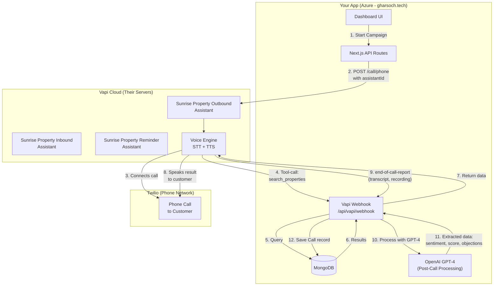
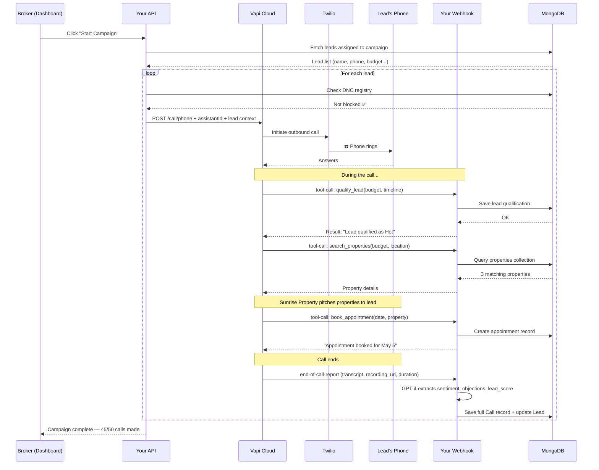
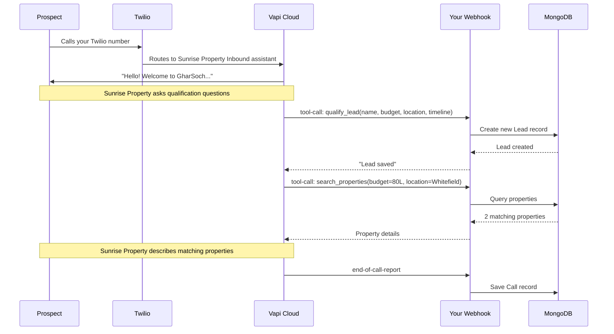
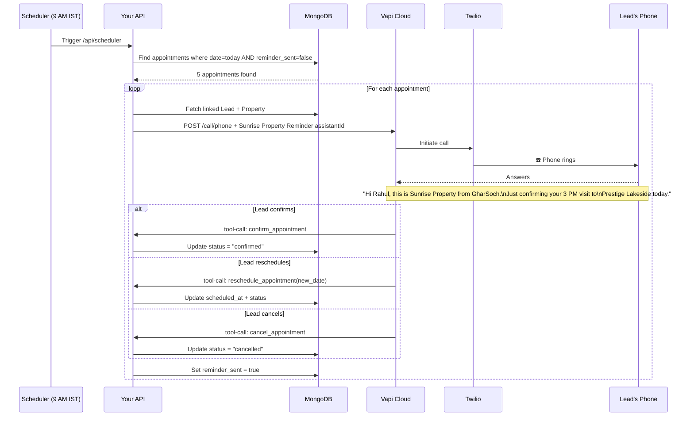

# GharSoch Voice Automation — Full Architecture

## The Big Picture

---

## Three Call Flows

### Flow 1: Outbound Campaign Call

### Flow 2: Inbound Call (Prospect Calls You)

### Flow 3: Automated Reminder (Daily 9 AM)

---

## Why No VM / Background Server?

| Component | Who Runs It | Cost |
|-----------|-------------|------|
| **Voice Processing** (STT, TTS, call handling) | Vapi's servers | Per-minute billing |
| **Phone Network** (connecting actual calls) | Twilio's servers | Per-minute billing |
| **AI Reasoning** (GPT-4 for tool responses) | OpenAI's servers | Per-token billing |
| **Business Logic** (webhook, CRUD, processing) | Your Next.js on Azure | Already deployed ✅ |
| **Database** (leads, calls, properties) | MongoDB Atlas / Cosmos | Already running ✅ |
| **Scheduler** (9 AM reminders) | Azure App Service cron OR Vapi's built-in scheduler | Free ✅ |

> [!TIP]
> Everything runs **on-demand**. When a call happens, Vapi hits your webhook. Your webhook processes it and responds. No always-on server, no GPU, no VM. Pure serverless.

---

## The Only Setup Required

1. **Create 3 Assistants in Vapi Dashboard** — each with tools and Server URL = `https://gharsoch.tech/api/vapi/webhook`
2. **Get a Twilio number** — import it into Vapi
3. **Set env vars** — `VAPI_ASSISTANT_OUTBOUND_ID`, `VAPI_ASSISTANT_INBOUND_ID`, `VAPI_ASSISTANT_REMINDER_ID`
4. **Build the webhook** — route tool-calls to the right MongoDB operations
